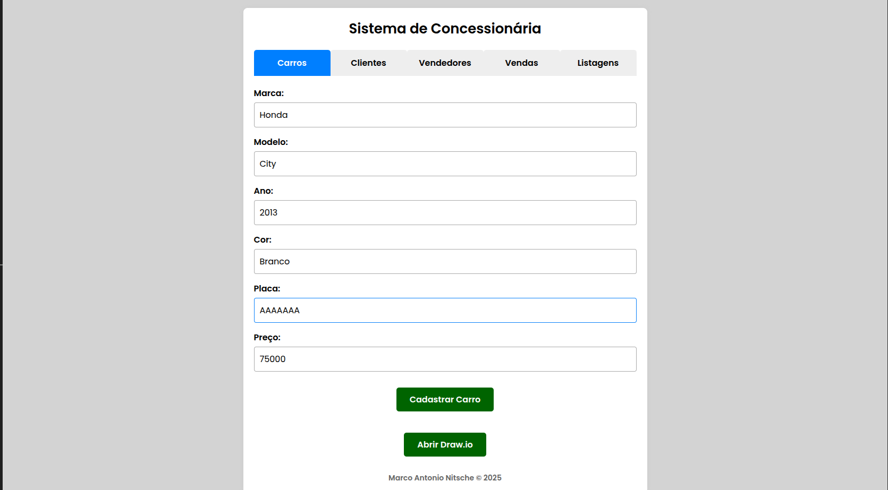
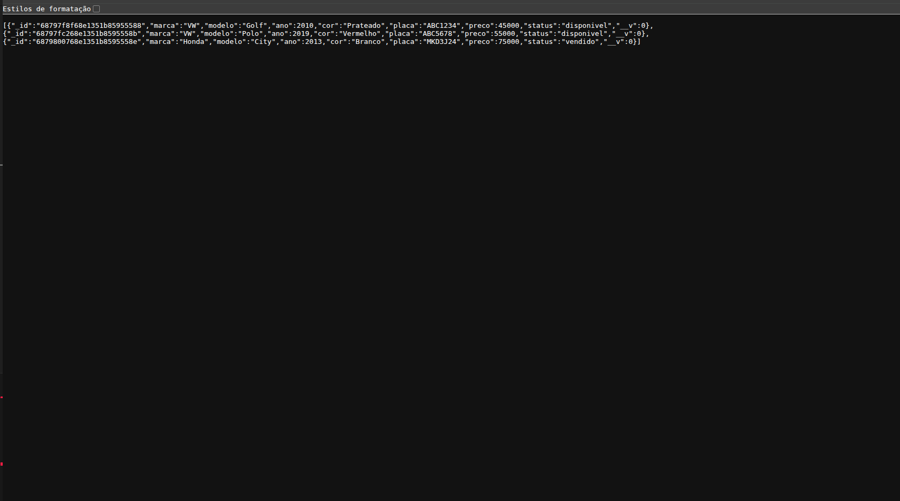
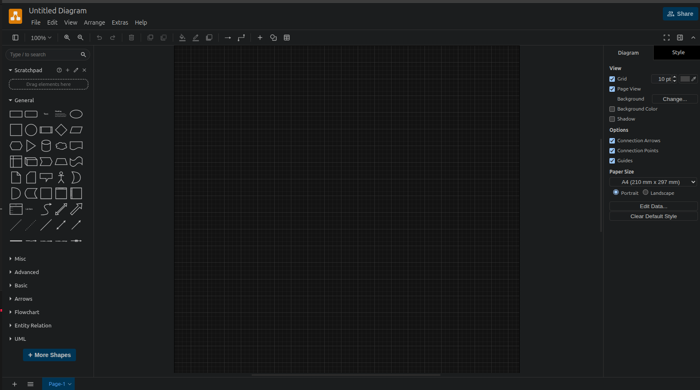

# concessionaria-docker

Este trabalho foi dividido em duas partes:

## 1. Ambiente Web Multi-Serviço utilizando Docker Compose

### Descrição:

O projeto trata-se de um sistema de gerenciamento de concessionárias de automóveis, onde é possível cadastrar veículos, clientes e vendedores, a partir disso, é possivel realizar uma venda, além de mostrar listagens dos carros que ainda estão disponíveis ou que já foram vendidos

### Ferramentas utilizadas:

- **Node.js** com **Express**: Backend da aplicação.
- **MongoDB**: Banco de dados NoSQL para armazenar dados de carros, vendas, clientes e vendedores.
- **Mongoose**: ODM para facilitar a modelagem e manipulação de dados MongoDB no Node.js.
- **Docker** e **Docker Compose**: Para orquestrar os serviços (frontend, backend, banco de dados).
- **HTML/CSS/JavaScript**: Frontend simples e responsivo.
- **Draw.io**: Ferramenta para criação de diagramas da arquitetura e modelo de dados.

Esse projeto envolve três conteineres principais:
- Um para o banco de dados.
- Um para o backend da aplicação.
- Um para o frontend da aplicação.

E ainda:
- Possui um valume para persistencia de dados no banco de dados.
- Uma rede compartilhada entre as imagens.
- E um arquivo .env para armazenar as variáveis de ambiente do projeto.

### Instruções de uso:

Para utilizar esse sistema, basta clonar este repositório, além de verificar quanto a exclusão de possíveis volumes antigos que estejam ativos, afim de evitar inconsistências no banco.

Tendo isso em mente, basta acessar a pasta raiz do projeto e executar os seguintes comandos:

~~~~
cp .env.template .env
~~~~

Para copiar para a pasta raiz do projeto, o arquivo oculto que armazena as variáveis de ambiente do projeto.

~~~~
docker-compose up --build
~~~~

Para rodar o projeto

### Acessos após iniciar:

Frontend:

http://localhost:8080

Backend:

Exemplo da rota para a listagem de carros:

http://localhost:3000/cars

## 2. Utilização de imagem do DockherHub

**Imagem usada:** jgraph/drawio

**Fonte:** https://hub.docker.com/r/jgraph/drawio

~~~~
services:
  drawio:
    image: jgraph/drawio
    container_name: app_drawio
    ports:
      - "8088:8080"
    networks:
      - netapp
~~~~

Draw.io é uma ferramenta de diagramas baseada na web, amplamente utilizada para criar fluxogramas, diagramas de rede, UML, entre outros. Permite criar e editar diagramas de forma visual, diretamente no navegador, sem necessidade de instalação local de softwares. Não há relação entre o drawio e o sistema desenvolvido na primeira parte deste projeto no entanto, para demonstrar o funcionamento da segunda parte do projeto, foi criado um botão no frontend, que acessa a imagem do drawio no seguinte endereço:

http://localhost:8888

